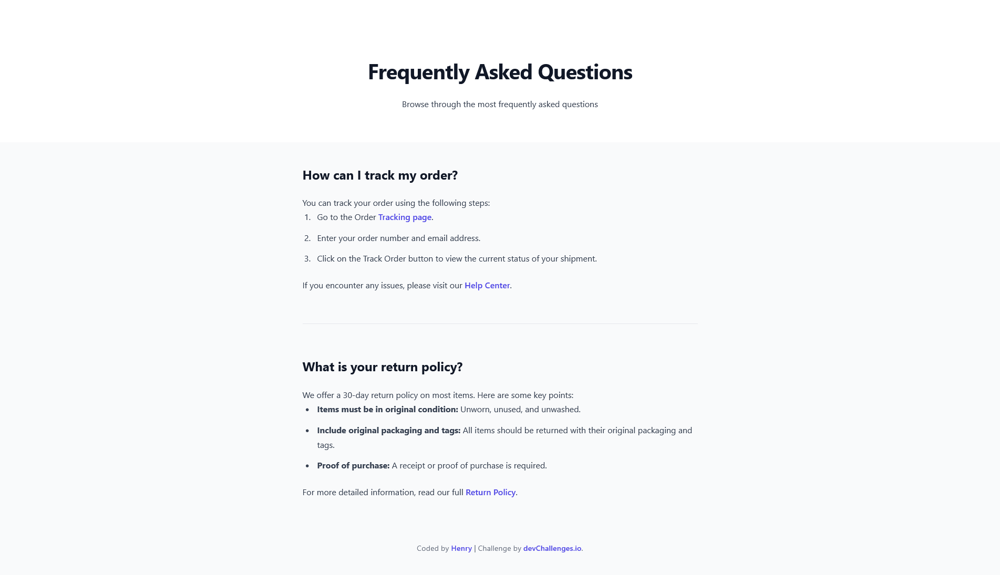

<!-- Please update value in the {}  -->

<h1 align="center">{Simple FAQ} | devChallenges</h1>

   Solution for a challenge <a href="https://devchallenges.io/challenge/simple-faq-challenge" target="_blank">Simple FAQ</a> from <a href="http://devchallenges.io" target="_blank">devChallenges.io</a>.

  <h3>
    <a href="{https://henrydevlab.github.io/simple-faq/}">
      Demo
    </a>
     | 
    <a href="{https://github.com/Henrydevlab/simple-faq}">
      Solution
    </a>
     | 
    <a href="https://devchallenges.io/challenge/simple-faq-challenge">
      Challenge
    </a>
  </h3>

<!-- TABLE OF CONTENTS -->

## Table of Contents

- [Overview](#overview)
  - [What I learned](#what-i-learned)
  - [Useful resources](#useful-resources)
- [Built with](#built-with)
- [Features](#features)
- [Contact](#contact)

<!-- OVERVIEW -->

## Overview

The goal of this project was to create a clean, professional FAQ page that is fully responsive across desktop, tablet, and mobile devices. It features a bright header that stretches across the viewport and a centered content body for optimal readability.

### What I learned

Through this project, I strengthened my ability to:

- **Semantic HTML**: Using `<header>`, `<main>`, and `<article>` for SEO.
- **Visual Contrast**: Implementing a "bright" vs "dull" background hierarchy without borders.
- **Accessibility**: Ensuring all links are navigatable with high-visibility focus states.

### Useful resources

- [MDN Web Docs: Responsive Design](https://developer.mozilla.org/en-US/docs/Learn_web_development/Core/CSS_layout/Responsive_Design) - This helped me manage the fluid layouts for different screen sizes.

- [Web.dev: SEO Basics](https://developer.mozilla.org/en-US/docs/Web/HTML/Reference/Elements/meta) - A great guide for implementing the meta tags and semantic structures used in this project

### Built with

<!-- This section should list any major frameworks that you built your project using. Here are a few examples.-->

- Semantic HTML5 markup
- CSS custom properties
- Flexbox
- Mobile-first workflow

## Features

- **Responsive**: Tailored views for Mobile (412px), Tablet (1024px), and Desktop (1350px).
- **Full-Width Header**: A bright, edge-to-edge header that contrasts with the duller main body background.
- **SEO Optimized**: Includes meta descriptions, titles, and semantic headers.
- **Accessible**: Fully navigatable using the keyboard with visible focus indicators.

This application/site was created as a submission to a [DevChallenges](https://devchallenges.io/challenges-dashboard) challenge.

## Author

- GitHub [@henrydevlab](https://{github.com/henrydevlab})
